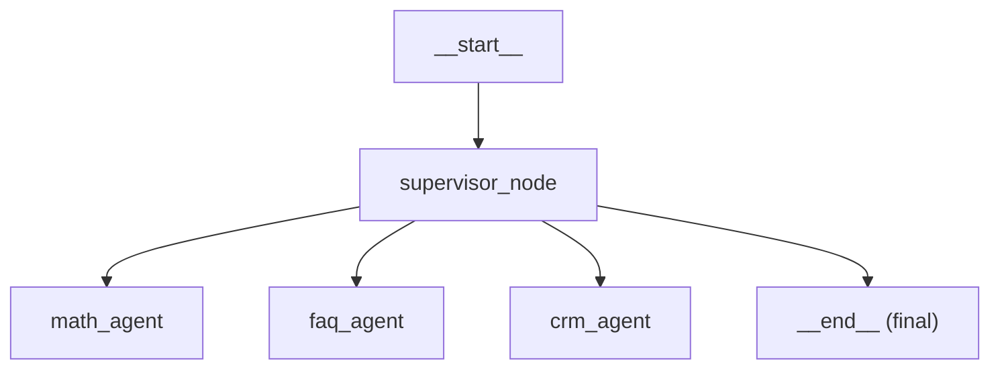

# 🧑‍💼 Customer Service Agent (LangGraph + LangChain Tools)

This project demonstrates how to build a **customer service agent** using [LangGraph](https://python.langchain.com/docs/langgraph) and [LangChain tools](https://python.langchain.com/docs/modules/tools).  
The agent can:
- Retrieve customer details by email
- Fetch all orders placed by a customer
- Answer user queries by invoking the appropriate tool

---

## 📂 Project Structure

- `utils.py` → contains `get_llm()` which initializes the LLM (e.g., VertexAI, OpenAI, etc.)
- `customers` → dictionary of customer records
- `orders` → dictionary of order records
- `get_customer` → tool to fetch customer details
- `get_orders_by_customer` → tool to fetch customer orders
- `customer_service_agent` → React-style agent that uses the tools

---
##  Install dependencies
uv add langchain langgraph
uv add "langchain[google-vertexai]"

##  Agent Definition
The agent uses the ReAct paradigm:- Decides which tool to call based on the user’s query.
- Calls the tool.
- Returns a natural language answer to the user.

📌 Notes- Ensure your customers and orders dictionaries are defined before running the agent.
- Keep sensitive data (like API keys) in a .env file and add .env to .gitignore.
- This example uses create_react_agent from langgraph.prebuilt.

----------------------------------------------------------------
# 🧠 Multi-Agent Supervisor Workflow (LangGraph + LangChain)

This project demonstrates how to build a **supervisor node** using [LangGraph](https://docs.langchain.com/langgraph/) and [LangChain](https://docs.langchain.com/) to route user queries to specialized agents. The supervisor uses an LLM to decide which agent should handle the request, based on the content of the user’s message.

---

## 📦 Architecture Overview



- **Supervisor Node**: Reads the latest user message, calls the LLM, and decides routing.
- **Agents**:
  - `math_agent`: Handles arithmetic and numerical queries.
  - `faq_agent`: Answers business FAQs.
  - `crm_agent`: Looks up customer information.
- **End**: Used when no agent is required or the supervisor handles the query directly.

---

## 🛠 Setup

1. **Install dependencies**
   ```bash
   uv pip install langchain langgraph
   ```

2. **Configure your LLM**
   ```python
   from utils import get_llm
   llm = get_llm()  # returns a LangChain-compatible model
   ```

3. **Define your agents** (`math_agent`, `faq_agent`, `crm_agent`) as LangGraph nodes.
---

## ✅ Best Practices

- Use `{"role": ..., "content": ...}` inside LangGraph nodes.
- Always validate supervisor output with `json.loads()`.
- Provide a safe fallback (`"final"`) when parsing fails.
